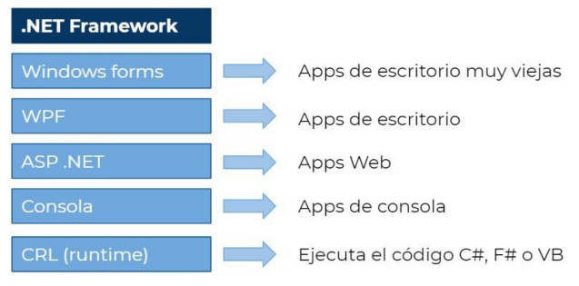
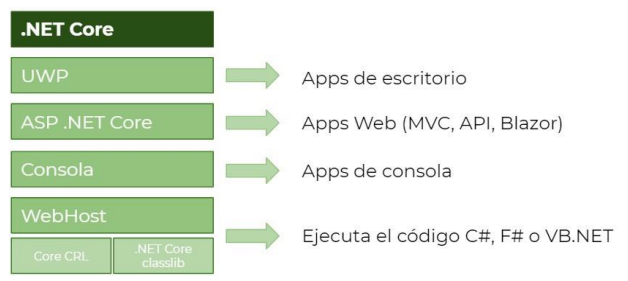
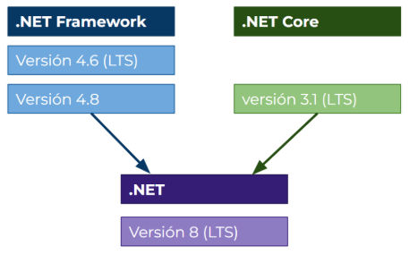
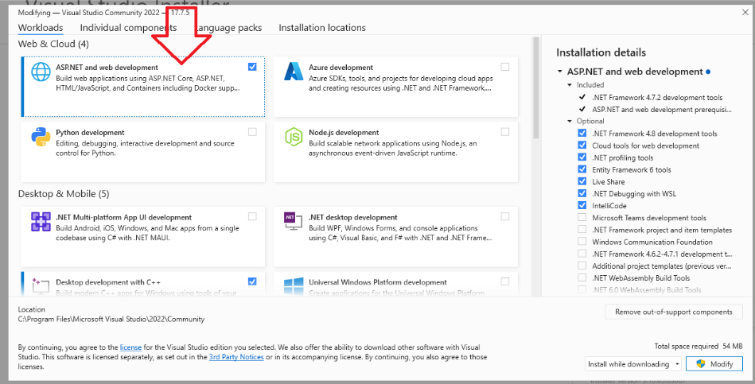

# Introduction to .NET and C#

For those new to the language, I believe this part is very important to understand before moving on to the subject itself. The first thing we have to understand is the difference between C# and .NET; C#, like F# or Visual Basic, are programming languages that are part of .NET, a framework that operates on these languages.

To be honest, the topic of the names that Microsoft gives to its frameworks or versions is something that I have personally been very critical of, as it is quite confusing. Here I will explain everything.

## .NET Framework

To do this, let's go back in history, in February 2002, Microsoft released the first version of .NET Framework, which was proprietary code, meaning paid and private. Along with the first version of the framework, Microsoft released the first version of Visual Studio, also paid. This software allows creating applications for Windows, in Windows environments, and constitutes the basis of what we do today.

We can understand .NET Framework as the base or engine that understands C#, F#, or Visual Basic code and converts it into machine code. All languages in the .NET family were and still are today high-level languages, which means that it is the framework that takes care of configuring, for example, the garbage collector (or "GC" in English).

From that first version, .NET Framework evolved and allowed us to create desktop, web, or console applications. The fact of programming with Windows allows us to access all Windows or Microsoft APIs, such as those of the Office suite, which gave .NET a competitive advantage over rivals in the business environment.

## .NET Core

Fast forward a few years, Microsoft realized that .NET Framework and its languages ​​could not compete head-to-head with the popular languages ​​of the moment and instead of giving up the battle, decided to take an unexpected action.

In 2016, Microsoft released .NET Core, a faster and lighter version than its predecessor, as well as Open Source, although much more important was the final detail, its ability to be cross-platform. With this change, .NET would be able to run on any type of machine.

This change was not a simple copy and paste of .NET Framework that allowed running on multiple platforms, but in the vast majority of cases, they had to do a complete refactoring or rewriting of code.

Apart from some technical changes on how each type of application runs, these were still the same, desktop, web, and console applications.

This change may seem small, but it is not, in the past, you needed a Windows server and a Windows machine to run your applications. Since the arrival of .NET Core, this is not necessary anymore since applications run on Linux, and if you think about it, it is a significant improvement since a Linux server has no license cost, while servers with Windows Server are usually much more expensive.

Microsoft realized that the change was very abrupt, since not only did the outer layers change, but much of the internal code is also different, so alongside .NET Core, they launched a framework called .NET Standard.

## .NET Standard

The migration from .NET Framework to .NET Core turned out to be much more complex than they imagined at first, so they decided to create a series of packages compatible between both systems. Although it is not evident at first glance, these packages are very useful for the migration of old code since these packages act as a junction point between applications written with .NET Framework and applications written with .NET Core.

The decision of whether we should create or use .NET Standard packages can be summarized as whether what you are doing needs compatibility with the .NET Framework system or not, if you do not need such compatibility, you can ignore these versions and jump to the more modern ones.

## .NET

Finally, to make things more complicated, Microsoft decided to put an end to .NET Framework, although the latest version (.NET Framework 4.8) will continue to be supported and maintained for many years (it does not have an end date, it is simply part of Windows), they will not continue developing new functionalities.

For all those who want new features, they will have to migrate to .NET, also called dotnet, instead of .NET Core that we have seen, but to .NET (without the "Core" suffix), and it is that in 2020 Microsoft announced .NET 5 removing the Core from its name, and thus unifying the frameworks that run on top of programming languages.

The current version is .NET 8 which is LTS or "Long Term Support". It is important to differentiate between versions that are LTS and those that are not, this is because LTS versions are like this because they have greater support and life than non-LTS versions. It is true that they will not bring new changes in functionality, but the end support date indicates the date on which it will stop receiving security updates.

For example, .NET 6 was released in November 2021 and has support until November 2024, 3 years (36 months), while .NET 7, which was released in November 2022, ends support in May 2024 (18 months).

Many companies do not allow using non-LTS versions for this reason.

## The .NET Development Environment

Although technically it is possible to program C# using Notepad, this practice is not productive and the experience is terrible. In the previous point, I mentioned that Microsoft released Visual Studio along with the languages.

Visual Studio is an IDE (Integrated Development Environment) designed to facilitate software development, mainly for Microsoft languages, although it has support for many more (JavaScript, Python, C, among others); This support provides us with functionalities such as autocomplete, syntax error detection in the code, or even a color palette that allows us to differentiate different elements of the code at a glance.

It has many more functionalities, such as integration with Git, integration with the database model, and many more, but all of that is beyond the scope of this book.

During this course, I will use Visual Studio, it is currently version 2022, don't worry, they don't release one every year. You can download the latest version from this link:

[Download Visual Studio](https://visualstudio.microsoft.com/es/vs/community/)

or by searching "Download Visual Studio".

Make sure to download the Community Edition which is the free version, as long as you don't use it for commercial purposes.

If you work with Linux or Mac, I personally recommend that you download Jetbrains Rider, it is an IDE similar to Visual Studio, but with a different interface and paid, with a 30-day trial version.

Until mid-2023, Visual Studio for Mac was an option, but Microsoft decided to cut development and the alternative is to use a Visual Studio Code extension called DevKit which is fine, but it is by no means similar to an IDE.

You can download Jetbrains Rider from here:

[Download Jetbrains Rider](https://www.jetbrains.com/es-es/rider/download/)

or by searching "Download Jetbrains Rider".

It is the IDE that I use on a daily basis in the work environment.

Then, you have to make sure you have downloaded the .NET SDK:

[Download .NET SDK](https://dotnet.microsoft.com/en-us/download)

Although if you are going to use Visual Studio, you can use the installer and install this package:

Once it is installed you can check that you have the SDK and the Runtime if you run the following commands in the terminal or in PowerShell:

dotnet --list-sdks
dotnet --list-runtimes

## What is NuGet?

Just as important as .NET itself, which Microsoft gives us, are the third-party libraries that complement the functionality.

NuGet is the default package manager for .NET. It is the virtual space where developers who write open-source code upload the libraries so that they can be accessed and used in a simple way.

To install these packages, the normal thing is to right-click either in the solution or in the project itself and there we have an option in the menu that says "manage NuGet packages". This menu has a searcher that by default looks in nuget.org.

Alternatively, we can use the command line to install these packages since when we install Visual Studio it comes with what is called "Package Manager".

In this book, everything we need is available in NuGet, but in the business environment, it is very common to have a private repository to maintain the company's common packages.

Thanks to NuGet we can streamline the development of projects in .NET since it is the central place where we will have the code that will be reused.
